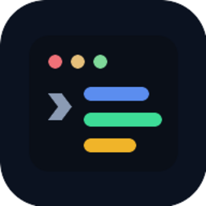
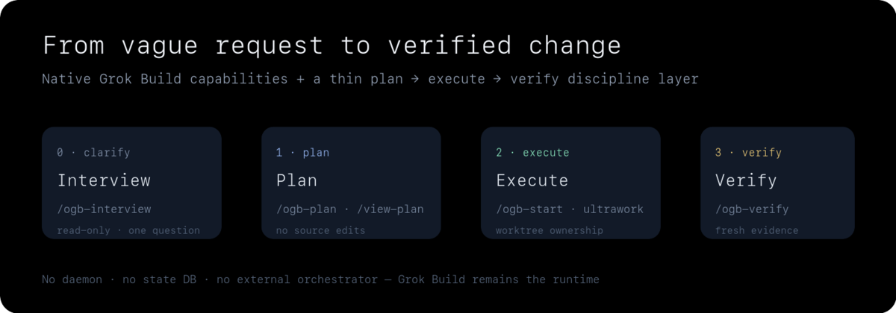
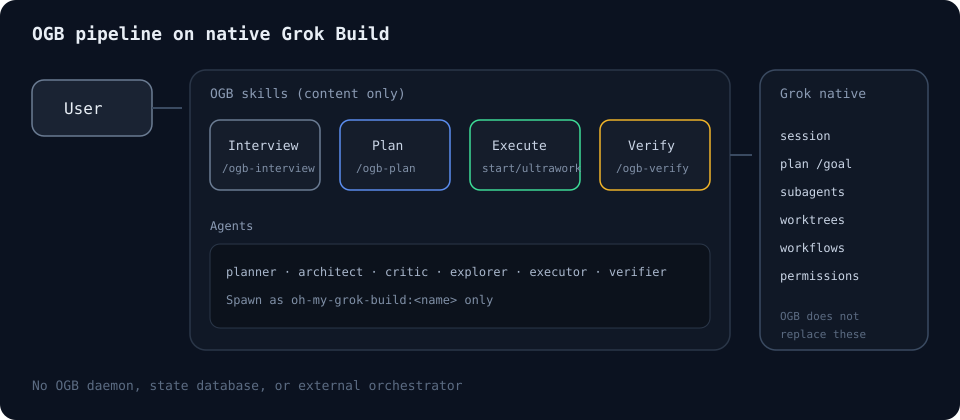
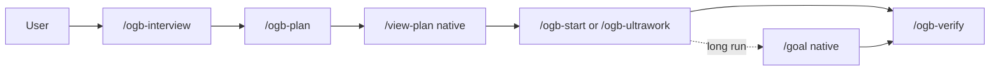
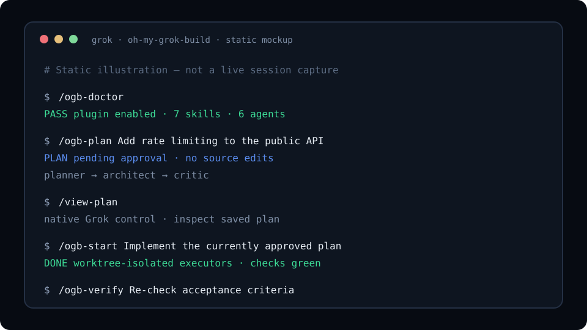

<p align="center">
  
</p>

<h1 align="center">oh-my-grok-build</h1>

<p align="center">
  <strong>Grok Build용 경량 오케스트레이션 규율:</strong><br>
  합의 계획, 제한된 병렬 실행, 독립 검증 — 네이티브 런타임 기능은 대체하지 않습니다.
</p>

<p align="center">
  <a href="https://github.com/xai-org/grok-build">Grok Build</a>용 독립 오픈소스 플러그인입니다. 콘텐츠 전용 스킬·에이전트. 별도 데몬, 상태 DB, 외부 오케스트레이터 없음.<br>
  <sub>xAI와 제휴하거나 공식 승인을 받은 프로젝트가 아닙니다. · <a href="https://docs.x.ai/build/overview">Grok Build 공식 문서</a></sub>
</p>

<p align="center">
  <a href="https://github.com/xai-org/grok-build"></a>
  <a href="https://github.com/duarbdhks/oh-my-grok-build/actions/workflows/validate.yml"></a>
  <a href="LICENSE"></a>
  <a href="plugins/oh-my-grok-build/plugin.json"></a>
</p>

<p align="center">
  <a href="README.md">English</a> ·
  <a href="docs/getting-started.ko.md">시작하기</a> ·
  <a href="docs/concepts.ko.md">개념</a> ·
  <a href="docs/command-reference.ko.md">명령</a> ·
  <a href="docs/architecture.ko.md">아키텍처</a> ·
  <a href="docs/validation.ko.md">검증</a>
</p>

<p align="center">
  
</p>

## 30초 Quick Start

```bash
grok plugin marketplace add duarbdhks/oh-my-grok-build
grok plugin install oh-my-grok-build --trust
grok plugin enable oh-my-grok-build
```

Grok Build 세션에서 (`/plugins` 리로드 또는 새 세션):

```text
/ogb-doctor
/ogb-plan Add a health endpoint that returns 200 and a build id
/view-plan
/ogb-start Implement the currently approved plan
/ogb-verify Re-check the acceptance criteria for the current changes
```

설치 옵션 더 보기: [시작하기](docs/getting-started.ko.md).

---

## 왜 oh-my-grok-build인가

멀티 에이전트 코딩은 자주 같은 방식으로 실패합니다.

| 고통 | 무엇이 잘못되나 |
|---|---|
| 모호함 → 코드 | 거친 요청이 미검토 소스 수정이 됨 |
| 병렬 충돌 | 여러 에이전트가 같은 파일을 고침 |
| 자기 승인 | 구현자가 자기 결과를 통과시킴 |
| 가짜 속도 | 에이전트는 늘지만 소유권·검증이 없음 |

OGB는 Grok Build가 이미 가진 기능 위에 얇은 규율만 더합니다.

1. 구조가 불명확하면 **interview / plan 먼저** — 계획 단계 소스 수정 없음
2. **제한된 소유 실행** — 네이티브 워크트리와 max-safe 동시성
3. **독립 검증** — 구현자와 분리된 최신 증거

별도 런타임을 만들지 않습니다. 세션, goal, 워크트리, 워크플로, 권한 상태는 Grok Build에 남습니다.

---

## 동작 방식





| 단계 | 명령 | 에이전트 | 소스 수정 | 안전장치 | 결과 |
|---|---|---|---|---|---|
| 정리 | `/ogb-interview` | explorer (선택) | 없음 | 턴당 질문 1개 | 방향 브리프 |
| 계획 | `/ogb-plan` | planner → architect → critic | 없음 | 승인 대기 | 저장 계획 |
| 검토 | `/view-plan` (네이티브) | — | 없음 | 사람/에이전트 검토 | 확인된 계획 |
| 실행 | `/ogb-start` | explorer, executor | 있음 (소유) | 워크트리 격리 | 구현 |
| 병렬 | `/ogb-ultrawork` | executor / explorer | 있음 (소유) | max-safe `C*` | 병렬 리포트 |
| 검증 | `/ogb-verify` | verifier | 없음 | 최신 증거 | PASS / FAIL / INCONCLUSIVE |

같은 루프의 정적 터미널 일러스트 (라이브 캡처 아님):

<p align="center">
  
</p>

---

## Quick Start (전체)

### 마켓플레이스 설치

```bash
grok plugin marketplace add duarbdhks/oh-my-grok-build
grok plugin install oh-my-grok-build --trust
grok plugin enable oh-my-grok-build
```

### 저장소 하위 경로 설치

```bash
grok plugin install duarbdhks/oh-my-grok-build#plugins/oh-my-grok-build --trust
grok plugin enable oh-my-grok-build
```

### 확인

```bash
grok plugin details oh-my-grok-build
grok inspect
```

이어서 `/ogb-doctor` → 첫 `/ogb-plan` → `/view-plan` → `/ogb-start` → `/ogb-verify`.

---

## 명령 매트릭스

| 명령 | 언제 | 산출물 | 소스 수정 | 병렬 | 주요 안전장치 |
|---|---|---|---|---|---|
| `/ogb-interview` | 아이디어가 모호 | 방향 브리프 | 없음 | 읽기 전용 explorer만 | 질문만 |
| `/ogb-plan` | 코드 전 합의 필요 | 저장 계획 | 없음 | 탐색만 | 같은 호출에서 실행 금지 |
| `/ogb-start` | 승인된 계획/구체 작업 | 구현 | 있음 | 웨이브 + 워크트리 | 소유권, 조용한 git 작업 금지 |
| `/ogb-ultrawork` | 독립 작업 준비됨 | 병렬 리포트 | 있음 | 예, 제한 `C*` | 같은 파일 금지, 예산 |
| `/ogb-verify` | 최신 증거 필요 | 판정 리포트 | 없음 | 읽기 전용 점검 | 구현자와 독립 |
| `/ogb-workflow` | 재사용 다단계 프로세스 | 워크플로 정의 | 정의만* | 워크플로 예산 안 | `validate_only` 선행 |
| `/ogb-doctor` | 설치 이상 | 진단 | 기본 없음 | 없음 | 네이티브 `/doctor` 보완 |

\*작성 시 워크플로 파일은 쓸 수 있으며, 기본으로 제품 기능을 구현하지 않습니다.

전체 계약: [명령 참고](docs/command-reference.ko.md).

### 제공 에이전트

| 에이전트 | 역할 |
|---|---|
| `oh-my-grok-build:planner` | 범위, 웨이브, 수용 기준 |
| `oh-my-grok-build:architect` | 구조 검토 |
| `oh-my-grok-build:critic` | 완성도·위험 게이트 |
| `oh-my-grok-build:explorer` | 읽기 전용 증거 |
| `oh-my-grok-build:executor` | 제한된 구현 |
| `oh-my-grok-build:verifier` | 독립 최종 점검 |

항상 **한정 이름**으로 spawn 하세요. bare `executor`는 같은 이름의 사용자 에이전트로 갈 수 있습니다.

---

## 실제 예시

```text
# 작은 버그
/ogb-plan Fix null displayName handling in the profile API without changing the response shape
/view-plan
/ogb-start Implement the currently approved plan
/ogb-verify Confirm null and happy-path cases

# 구조적 기능
/ogb-plan Add optimistic locking on profile update; return 409 on conflict; include tests

# 독립 모듈 병렬
/ogb-ultrawork Fix TypeScript errors in three independent packages with worktree isolation

# 기존 작업 재검증
/ogb-verify Re-verify origin/main...HEAD against the plan acceptance criteria; do not edit source

# 네이티브 /goal과 장시간
/ogb-plan Fix duplicate processing in the payment webhook
/goal Implement the currently saved plan. Preserve unrelated changes. No commit, push, or deploy.
/ogb-verify Final re-check of the saved plan acceptance criteria

# 모호한 요청
/ogb-interview We need rate limiting on the public API but keys and limits are undecided
```

더 보기: [예시](docs/examples.ko.md).

---

## 아키텍처

OGB는 실행 엔진이 아니라 운영 규율 계층입니다.


| 관심사 | 소유자 |
|---|---|
| 세션 저장/재개 | Grok Build |
| `/goal` 자율 상태 | Grok Build |
| 서브에이전트 생명주기 | Grok Build |
| 워크트리 | Grok Build |
| 워크플로 런타임 | Grok Build |
| 계획 품질 게이트 | OGB |
| 소유권/웨이브 규칙 | OGB |
| 독립 검증 순서 | OGB |

상세: [아키텍처](docs/architecture.ko.md).

---

## 네이티브 vs OGB

| 기능 | Grok Build 네이티브 | OGB |
|---|---|---|
| 세션 연속성 | `grok -c` / `grok -r` | 네이티브 재개가 있을 때만 기록 |
| 워크트리 관리 | 생성/적용/정리 | 스킬에서 격리 정책 지시 |
| 서브에이전트 실행 | `spawn_subagent` | 한정 플러그인 에이전트 계약 |
| 워크플로 런타임 | Rhai, 예산, 일시정지 | `/ogb-workflow` + 가드로 작성 |
| Goal 모드 | `/goal` | 재구현하지 않음; plan + verify와 조합 |
| 계획 규율 | Plan mode + 저장 계획 | Planner → Architect → Critic |
| 소유권 경계 | — | 웨이브당 겹치지 않는 파일 소유 |
| 독립 검증 | `check-work` 가용 | `/ogb-verify` + `verifier` |
| 증거 기반 완료 | — | 실제 실행한 로그만 PASS |

---

## 안전·설계 원칙

1. **Native-first** — session, goal, worktree, subagent, workflow 상태 재구현 금지
2. **Bounded parallelism** — max-safe `C*`, 잔여 예산, 워크플로 `agent_budget`
3. **계획과 실행 분리** — `/ogb-plan`은 구현하지 않음
4. **독립 검증** — 구현자가 최종 게이트를 스스로 통과시키지 않음
5. **Evidence over confidence** — 실제로 돌린 점검만 보고
6. **No silent fallback** — 조용한 모델/도구/MCP 교체 금지
7. **Git 보호** — 명시 요청 없이 commit, push, PR, force-reset 금지

스킬 7개 모두 `disable-model-invocation: true`.

---

## 프로젝트 상태

플러그인 버전 **0.1.0**. 독립 서드파티 마켓플레이스 플러그인입니다 (별도 공식 리스팅 절차가 끝나기 전까지 xAI 공식 목록이 아님 — [게시](docs/publishing.ko.md)).

| 범위 | 상태 |
|---|---|
| 정적 저장소 게이트 (`npm test`) | 현재 트리에서 PASS (로컬/CI 실행) |
| Grok `0.2.112` 역사 라이브 스킬 | PASS (원본 6스킬 + 이후 `/ogb-interview` + 체인/스케줄링 증거) |
| Grok `0.2.118` 호환 영수증 | 정적 + `grok plugin validate` PASS; **현재 명령 라이브 UX `NOT RUN`** |
| 저장 워크플로 `script_path` 폴더 신뢰 | 역사적 **LIMITATION** |
| 워크트리 충돌 경로 | 미검증 (성공 런에 소유 겹침 없음) |

역사적 `0.2.112` 라이브 런을 이후 CLI 빌드의 자동 증명으로 보지 마세요. 전체 영수증: [검증](docs/validation.ko.md).

---

## FAQ

| 질문 | 짧은 답 |
|---|---|
| Grok Build 포크? | 아니오 — 서드파티 플러그인 |
| Claude 데몬 같은 별도 엔진? | 아니오 — 콘텐츠 전용 |
| Claude / Anthropic API 필요? | 아니오 |
| 외부 agent pack 필수? | 아니오 |
| `/goal` 대체? | 아니오 |
| 무제한 병렬? | 아니오 — 상한 있음 |
| Git 상태 보호? | 스킬 지시로 보호 (권한은 사용자) |
| 검증된 Grok 버전? | 라이브 `0.2.112`; 정적 영수증 `0.2.118` |
| 새 세션에 계획 유지? | 자동 아니오 — `grok -c` / `grok -r` |
| 프로덕션 자동 승인? | 아니오 |

전체 FAQ: [docs/faq.ko.md](docs/faq.ko.md).

---

## 문서 탐색

| 목적 | 문서 |
|---|---|
| 시작하기 | [docs/getting-started.ko.md](docs/getting-started.ko.md) |
| 개념 | [docs/concepts.ko.md](docs/concepts.ko.md) |
| 아키텍처 | [docs/architecture.ko.md](docs/architecture.ko.md) |
| 명령 참고 | [docs/command-reference.ko.md](docs/command-reference.ko.md) |
| 예시 | [docs/examples.ko.md](docs/examples.ko.md) |
| 문제 해결 | [docs/troubleshooting.ko.md](docs/troubleshooting.ko.md) |
| 검증 증거 | [docs/validation.ko.md](docs/validation.ko.md) |
| 호환성 | [docs/compatibility.ko.md](docs/compatibility.ko.md) |
| 설계 결정 | [docs/design-decisions.ko.md](docs/design-decisions.ko.md) |
| 로드맵 | [docs/roadmap.ko.md](docs/roadmap.ko.md) |
| 게시 | [docs/publishing.ko.md](docs/publishing.ko.md) |
| GitHub 소유자 메타 | [docs/github-metadata.ko.md](docs/github-metadata.ko.md) |
| 업스트림 평가 | [docs/upstream-evaluation.ko.md](docs/upstream-evaluation.ko.md) |
| 기여 | [CONTRIBUTING.md](CONTRIBUTING.md) |
| 보안 | [SECURITY.md](SECURITY.md) |
| 변경 이력 | [CHANGELOG.md](CHANGELOG.md) |
| 브랜드 에셋 | [assets/brand/README.md](assets/brand/README.md) |
| 법적 고지 | [NOTICE.md](NOTICE.md) · [LICENSE](LICENSE) |

---

## 개발·검증 (이 저장소)

런타임 패키지 의존성 없음. 정적 검사용 Node.js `>=20`.

```bash
npm test
npm run validate:grok
```

---

## 귀속·상표

독립 clean-room 구현. 업스트림 영감과 법적 고지: [NOTICE.md](NOTICE.md).

xAI 및 고지에 적힌 업스트림 프로젝트와 제휴·공식 승인 관계가 없습니다. Grok과 Grok Build는 각 소유자의 상표일 수 있습니다.

## 라이선스

[MIT](LICENSE)
