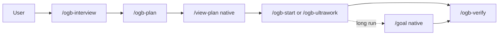

<p align="center">
  
</p>

<h1 align="center">oh-my-grok-build</h1>

<p align="center">
  <strong>Lightweight orchestration discipline for Grok Build:</strong><br>
  consensus planning, bounded parallel execution, and independent verification — without replacing native runtime features.
</p>

<p align="center">
  Independent open-source plugin for <a href="https://github.com/xai-org/grok-build">Grok Build</a>. Content-only skills and agents. No second daemon, state database, or external orchestrator.<br>
  <sub>Not affiliated with or endorsed by xAI. · <a href="https://docs.x.ai/build/overview">Official Grok Build docs</a></sub>
</p>

<p align="center">
  <a href="https://github.com/xai-org/grok-build"></a>
  <a href="https://github.com/duarbdhks/oh-my-grok-build/actions/workflows/validate.yml"></a>
  <a href="LICENSE"></a>
  <a href="plugins/oh-my-grok-build/plugin.json"></a>
</p>

<p align="center">
  <a href="README.ko.md">한국어</a> ·
  <a href="docs/getting-started.md">Getting started</a> ·
  <a href="docs/concepts.md">Concepts</a> ·
  <a href="docs/command-reference.md">Commands</a> ·
  <a href="docs/architecture.md">Architecture</a> ·
  <a href="docs/validation.md">Validation</a>
</p>

<p align="center">
  
</p>

## 30-second Quick Start

```bash
grok plugin marketplace add duarbdhks/oh-my-grok-build
grok plugin install oh-my-grok-build --trust
grok plugin enable oh-my-grok-build
```

In a Grok Build session (reload `/plugins` or start a new session):

```text
/ogb-doctor
/ogb-plan Add a health endpoint that returns 200 and a build id
/view-plan
/ogb-start Implement the currently approved plan
/ogb-verify Re-check the acceptance criteria for the current changes
```

More install options: [Getting started](docs/getting-started.md).

---

## Why oh-my-grok-build

Multi-agent coding often fails in predictable ways:

| Pain | What goes wrong |
|---|---|
| Vague → code | A rough request becomes unreviewed source edits |
| Parallel collisions | Several agents edit the same files and thrash the tree |
| Self-approval | The implementer marks its own work done |
| Fake speed | More agents run, but ownership and verification are missing |

OGB adds a thin discipline layer on top of capabilities Grok Build already has:

1. **Interview / plan first** when structure is unclear — no source edits in planning
2. **Bounded, owned execution** with native worktrees and max-safe concurrency
3. **Independent verification** with fresh evidence, separate from the implementer

It does **not** invent a second runtime. Session, goal, worktree, workflow, and permission state stay in Grok Build.

---

## How it works




| Stage | Command | Agents | Edits source? | Safeguard | Result |
|---|---|---|---|---|---|
| Clarify | `/ogb-interview` | explorer (optional) | No | One question / turn | Direction brief |
| Plan | `/ogb-plan` | planner → architect → critic | No | Pending approval | Saved plan |
| Inspect | `/view-plan` (native) | — | No | Human/agent review | Confirmed plan |
| Execute | `/ogb-start` | explorer, executor | Yes (owned) | Worktree isolation | Implementation |
| Parallel | `/ogb-ultrawork` | executor / explorer | Yes (owned) | Max-safe `C*` | Parallel report |
| Verify | `/ogb-verify` | verifier | No | Fresh evidence | PASS / FAIL / INCONCLUSIVE |

Static terminal illustration of the same loop (not a live capture):

<p align="center">
  
</p>

---

## Quick Start (full)

### Marketplace install

```bash
grok plugin marketplace add duarbdhks/oh-my-grok-build
grok plugin install oh-my-grok-build --trust
grok plugin enable oh-my-grok-build
```

### Install from repository subdirectory

```bash
grok plugin install duarbdhks/oh-my-grok-build#plugins/oh-my-grok-build --trust
grok plugin enable oh-my-grok-build
```

### Confirm

```bash
grok plugin details oh-my-grok-build
grok inspect
```

Then `/ogb-doctor` → first `/ogb-plan` → `/view-plan` → `/ogb-start` → `/ogb-verify`.

---

## Command matrix

| Command | When | Produces | Edits source? | Parallel? | Main safeguard |
|---|---|---|---|---|---|
| `/ogb-interview` | Idea is vague | Direction brief | No | Read-only explorers only | Questioning only |
| `/ogb-plan` | Need agreement before code | Saved plan | No | Exploration only | No execution in same call |
| `/ogb-start` | Approved plan / concrete task | Implementation | Yes | Waves + worktrees | Ownership + no silent git ops |
| `/ogb-ultrawork` | Independent tasks ready | Parallel report | Yes | Yes, bounded `C*` | Same-file ban, budgets |
| `/ogb-verify` | Need fresh evidence | Verdict report | No | Read-only checks | Independent of implementer |
| `/ogb-workflow` | Reusable multi-step process | Workflow definition | Definition only* | Inside workflow budget | `validate_only` first |
| `/ogb-doctor` | Install looks wrong | Diagnosis | No (default) | No | Complements native `/doctor` |

\*May write workflow files when authoring; does not implement product features by default.

Full contracts: [Command reference](docs/command-reference.md).

### Agents shipped

| Agent | Role |
|---|---|
| `oh-my-grok-build:planner` | Scope, waves, acceptance criteria |
| `oh-my-grok-build:architect` | Structural review |
| `oh-my-grok-build:critic` | Completeness / risk gate |
| `oh-my-grok-build:explorer` | Read-only evidence |
| `oh-my-grok-build:executor` | Bounded implementation |
| `oh-my-grok-build:verifier` | Independent final check |

Always spawn the **qualified** name. A bare `executor` can hit a same-named user agent.

---

## Real examples

```text
# Small bug
/ogb-plan Fix null displayName handling in the profile API without changing the response shape
/view-plan
/ogb-start Implement the currently approved plan
/ogb-verify Confirm null and happy-path cases

# Structural feature
/ogb-plan Add optimistic locking on profile update; return 409 on conflict; include tests

# Parallel independent modules
/ogb-ultrawork Fix TypeScript errors in three independent packages with worktree isolation

# Re-verify existing work
/ogb-verify Re-verify origin/main...HEAD against the plan acceptance criteria; do not edit source

# Long run with native /goal
/ogb-plan Fix duplicate processing in the payment webhook
/goal Implement the currently saved plan. Preserve unrelated changes. No commit, push, or deploy.
/ogb-verify Final re-check of the saved plan acceptance criteria

# Vague request
/ogb-interview We need rate limiting on the public API but keys and limits are undecided
```

More: [Examples](docs/examples.md).

---

## Architecture

OGB is an operating discipline layer, not an execution engine.


| Concern | Owner |
|---|---|
| Session save / resume | Grok Build |
| `/goal` autonomous state | Grok Build |
| Subagent lifecycle | Grok Build |
| Worktrees | Grok Build |
| Workflow runtime | Grok Build |
| Plan quality gate | OGB |
| Ownership / wave rules | OGB |
| Independent verification order | OGB |

Deep dive: [Architecture](docs/architecture.md).

---

## Native vs OGB

| Capability | Grok Build native | OGB |
|---|---|---|
| Session continuity | `grok -c` / `grok -r` | Records continuity only when native resume occurred |
| Worktree management | Create / apply / clean | Directs isolation policy in skills |
| Subagent execution | `spawn_subagent` | Spawns qualified plugin agents with contracts |
| Workflow runtime | Rhai workflows, budgets, pause | Authors via `/ogb-workflow` + guards |
| Goal mode | `/goal` | Does not reimplement; pair with plan + verify |
| Planning discipline | Plan mode + saved plan | Planner → Architect → Critic consensus |
| Ownership boundaries | — | Non-overlapping file ownership per wave |
| Independent verification | Bundled `check-work` available | `/ogb-verify` + `verifier` gate |
| Evidence-based completion | — | Fresh logs required for PASS claims |

---

## Safety and design principles

1. **Native-first** — do not reimplement session, goal, worktree, subagent, or workflow state
2. **Bounded parallelism** — max-safe `C*`, residual budgets, workflow `agent_budget`
3. **Separate planning and execution** — `/ogb-plan` never implements
4. **Independent verification** — implementer does not self-certify the final gate
5. **Evidence over confidence** — report only checks that actually ran
6. **No silent fallback** — no quiet model/tool/MCP swaps
7. **Git protection** — no commit, push, PR, or force-reset without an explicit request

All seven skills set `disable-model-invocation: true`.

---

## Project status

Plugin version **0.1.0**. Independent third-party marketplace plugin (not an official xAI listing unless/until the separate marketplace process completes — see [publishing](docs/publishing.md)).

| Scope | Status |
|---|---|
| Static repo gate (`npm test`) | PASS on current tree (run locally / CI) |
| Historical live skills on Grok `0.2.112` | PASS (six original skills + later `/ogb-interview` + chain/scheduling evidence) |
| Compatibility receipt on Grok `0.2.118` | Static + `grok plugin validate` PASS; **current command live UX `NOT RUN`** |
| Saved workflow `script_path` folder trust | Historical **LIMITATION** |
| Worktree conflict path | Still unverified (no overlapping ownership in successful runs) |

Do not treat historical `0.2.112` live runs as automatic proof for every later CLI build. Full receipts: [Validation](docs/validation.md).

---

## FAQ

| Question | Short answer |
|---|---|
| Fork of Grok Build? | No — third-party plugin |
| Separate engine like a Claude daemon? | No — content-only |
| Claude / Anthropic API required? | No |
| External agent pack required? | No |
| Replaces `/goal`? | No |
| Unlimited parallel agents? | No — bounded |
| Protects Git state? | Yes, by skill instruction (you still control permissions) |
| Validated Grok versions? | Live `0.2.112`; static receipt `0.2.118` |
| Plans in a brand-new session? | Not automatically — use `grok -c` / `grok -r` |
| Production auto-approved? | No |

Full FAQ: [docs/faq.md](docs/faq.md).

---

## Documentation navigation

| Goal | Doc |
|---|---|
| Getting started | [docs/getting-started.md](docs/getting-started.md) |
| Concepts | [docs/concepts.md](docs/concepts.md) |
| Architecture | [docs/architecture.md](docs/architecture.md) |
| Command reference | [docs/command-reference.md](docs/command-reference.md) |
| Examples | [docs/examples.md](docs/examples.md) |
| Troubleshooting | [docs/troubleshooting.md](docs/troubleshooting.md) |
| Validation evidence | [docs/validation.md](docs/validation.md) |
| Compatibility | [docs/compatibility.md](docs/compatibility.md) |
| Design decisions | [docs/design-decisions.md](docs/design-decisions.md) |
| Roadmap | [docs/roadmap.md](docs/roadmap.md) |
| Publishing | [docs/publishing.md](docs/publishing.md) |
| GitHub owner metadata | [docs/github-metadata.md](docs/github-metadata.md) |
| Upstream evaluation | [docs/upstream-evaluation.md](docs/upstream-evaluation.md) |
| Contributing | [CONTRIBUTING.md](CONTRIBUTING.md) |
| Security | [SECURITY.md](SECURITY.md) |
| Changelog | [CHANGELOG.md](CHANGELOG.md) |
| Brand assets | [assets/brand/README.md](assets/brand/README.md) |
| Legal / attribution | [NOTICE.md](NOTICE.md) · [LICENSE](LICENSE) |

---

## Development and validation (this repository)

No runtime package dependencies. Node.js `>=20` for static checks only.

```bash
npm test
npm run validate:grok
```

---

## Attribution and trademarks

Independent clean-room implementation. Upstream inspiration and legal notice: [NOTICE.md](NOTICE.md).

Not affiliated with or endorsed by xAI or any upstream project named in the notice. Grok and Grok Build may be trademarks of their respective owners.

## License

[MIT](LICENSE)
