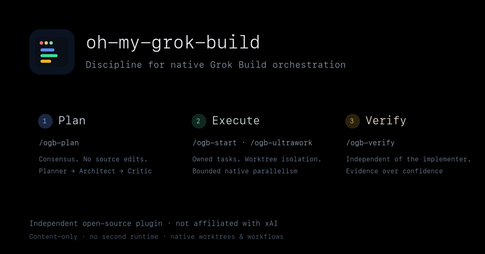

<p align="center">
  
</p>

<h1 align="center">oh-my-grok-build</h1>

<p align="center">
  <em>A field manual for native planning, bounded parallel execution, and independent verification.</em>
</p>

<p align="center">
  Independent open-source plugin for <a href="https://github.com/xai-org/grok-build">Grok Build</a>.<br>
  <sub>Not affiliated with or endorsed by xAI. · <a href="https://docs.x.ai/build/overview">Official Grok Build docs</a></sub>
</p>

<p align="center">
  <a href="https://github.com/xai-org/grok-build"></a>
  <a href="https://github.com/duarbdhks/oh-my-grok-build/actions/workflows/validate.yml"></a>
  <a href="LICENSE"></a>
</p>

<p align="center">
  <a href="README.ko.md">한국어</a> ·
  <a href="docs/upstream-evaluation.md">Design Evaluation</a> ·
  <a href="docs/architecture.md">Architecture</a> ·
  <a href="docs/roadmap.md">Roadmap</a>
</p>

<p align="center">
  
</p>

A Grok Build-native toolkit for planning, parallel execution, and verification. It builds directly on Grok Build's own plugins, subagents, worktrees, workflows, and goal mode — no separate runtime, hooks daemon, or external orchestrator.

## Focus

This repository does one thing:

> Reuse the execution foundation Grok Build already does well, and add only a thin layer of plan → execute → independent-verify quality discipline.

For why a full upstream fork was rejected, see [Design Evaluation](docs/upstream-evaluation.md).

## Commands

| Command | Role | Default safeguard |
|---|---|---|
| `/ogb-interview` | One question at a time until a vague idea becomes a direction brief | No source edits; questioning only, never plans or implements |
| `/ogb-plan` | Planner → Architect → Critic consensus plan | No source edits; up to 3 review loops |
| `/ogb-start` | Execute an approved plan | Separates task ownership; writes are isolated in worktrees |
| `/ogb-ultrawork` | Cut the elapsed time of independent tasks by running them in parallel | Max-safe `C*` concurrency (default iso 4, up to 8 when isolation proven, 2 on shared resources) plus ROLE_LENS on each child; workflow agent budget of 8 |
| `/ogb-verify` | Test / type-check / build / independent verification | No completion verdict without fresh execution evidence |
| `/ogb-workflow` | Author reusable Grok workflows | Requires `create-workflow` first, and `validate_only` |
| `/ogb-doctor` | Diagnose plugin, agent, and native-capability status | Read-only by default |

### Choose the right command

| Request shape | Choose | Avoid when | Native boundary |
|---|---|---|---|
| The direction is still vague | `/ogb-interview` | Requirements and acceptance criteria are already concrete | Produces a direction brief; it does not save or execute a plan |
| The change is structural, risky, or needs agreement | `/ogb-plan` | The task is already small, concrete, and approved | Save and inspect the result with Grok's plan controls such as `/view-plan` |
| An approved plan or concrete task should run sequentially | `/ogb-start` | Two or more tasks are safely independent | Grok owns session continuity and worktrees; OGB reports their lifecycle |
| Two or more bounded tasks can run independently | `/ogb-ultrawork` | Files, resources, or acceptance criteria overlap | Grok owns subagents, worktrees, and workflow execution |
| Existing work needs fresh evidence | `/ogb-verify` | The user is asking for implementation | Runs verification only; it does not repair failures unless separately requested |
| A repeated multi-step process should become reusable | `/ogb-workflow` | The need is a one-off execution or plan | Grok's bundled `create-workflow` authors the workflow; native workflow controls run and resume it |
| Installation or capability status is unclear | `/ogb-doctor` | The task is application debugging | Complements, but does not replace, Grok's native `/doctor` and `grok inspect` |

### Native controls OGB does not replace

| Native control | Use it for | OGB relationship |
|---|---|---|
| `/view-plan` | Inspecting the currently saved plan | Review an `/ogb-plan` result before execution |
| `/goal` | Long-running autonomous execution | Run an approved plan, then use `/ogb-verify` for independent verification |
| Native workflow run and resume | Executing or resuming a saved workflow run | `/ogb-workflow` authors the definition; it does not create a second workflow runtime |
| Native `/doctor` and `grok inspect` | Grok-wide diagnostics | `/ogb-doctor` adds plugin-specific checks |
| `grok -c` and `grok -r` | Continuing or resuming Grok sessions | OGB records continuity when it actually occurred; it never emulates it |

The plugin also ships the following agents:

- `oh-my-grok-build:planner`: Designs scope, task graphs, and acceptance criteria.
- `oh-my-grok-build:architect`: Reviews structural soundness and trade-offs.
- `oh-my-grok-build:critic`: Blocks gaps, contradictions, and unverifiable items.
- `oh-my-grok-build:explorer`: Gathers codebase evidence, read-only.
- `oh-my-grok-build:executor`: Performs scope-limited implementation work.
- `oh-my-grok-build:verifier`: Reproduces the final result independently of the implementer.

Grok registers plugin agents under a plugin-qualified name and skills under a bare name, so the two follow opposite conventions here. Agents carry no `ogb-` prefix — the `oh-my-grok-build:` qualifier already namespaces them, and the file name and frontmatter `name` are the short form. Skills keep the prefix, because `/ogb-plan` has nothing else to distinguish it.

Always spawn agents with the qualified name. Dropping the prefix does not fail loudly: a bare `planner` or `executor` can resolve to an unrelated agent of the same name in your own `~/.grok/agents/` or `~/.claude/agents/`, and the work then runs with the wrong prompt. `npm test` rejects an unqualified agent reference inside a skill, and `/ogb-doctor` reports same-named agents in your environment as warnings.

### Pairing with a wider agent roster

These six agents are all the seven skills need — nothing else has to be installed for `/ogb-interview` through `/ogb-doctor` to work. The plugin deliberately stops there rather than shipping a general agent library.

If you want specialists for work outside that scope — code review, security audit, database tuning, incident response — a third-party roster such as [`msitarzewski/agency-agents`](https://github.com/msitarzewski/agency-agents) (MIT) covers it. It has no Grok-specific installer, but Grok discovers agent definitions in `~/.claude/agents/` through its Claude compatibility layer, so its Claude Code target works:

```bash
./scripts/install.sh --tool claude-code
```

This is a suggestion, not a dependency. Nothing in this plugin is bundled from or affiliated with that project.

## Install

### Marketplace method

```bash
grok plugin marketplace add duarbdhks/oh-my-grok-build
grok plugin install oh-my-grok-build --trust
grok plugin enable oh-my-grok-build
```

### Install the repository subdirectory directly

```bash
grok plugin install duarbdhks/oh-my-grok-build#plugins/oh-my-grok-build --trust
grok plugin enable oh-my-grok-build
```

Check the install status with:

```bash
grok plugin details oh-my-grok-build
grok inspect
```

In a Grok Build session, reload the plugin from `/plugins` or start a new session, then run `/ogb-doctor`.

## Recommended usage flows

### Safe feature implementation

```text
/ogb-plan Add optimistic locking to the user profile API and return 409 on conflict
```

Review the plan with `/view-plan`, then execute it.

```text
/ogb-start Implement the currently approved plan
```

### Parallel work

```text
/ogb-ultrawork Fix the TypeScript errors in these three independent modules and verify each one
```

`/ogb-ultrawork` schedules with Grok Build's own subagents, background execution, and `workflow` tool only — it never calls an external orchestrator. It scores a max-safe concurrent count `C*` from ownership and isolation, launches up to that ceiling with a closed ROLE_LENS on each child, and prefers native workflow for large schema-shaped fan-out. Speed comes from removing serial waits, not from relaxing worktree isolation, ownership, budgets, or verification.

### Re-running verification only

```text
/ogb-verify Re-verify that the changes in origin/main...HEAD meet the requirements
```

### Long-running autonomous work

This project does not build a separate Autopilot state machine. First lock in a plan with OGB, run it for a long duration with Grok Build's native `/goal`, then run OGB verification separately.

```text
/ogb-plan Fix the duplicate-processing bug in the payment webhook
/goal Implement the currently saved plan. Preserve unrelated changes, isolate parallel writes in worktrees, and do not commit, push, or deploy.
/ogb-verify Do a final re-verification of the currently saved plan's acceptance criteria
```

Because `disable-model-invocation` is enabled, `/goal` will not silently invoke OGB skills. For operations, security, auth, data-migration, payments, and PII work, keep planning and verification explicitly separate, as shown above.

## Design principles

1. **Native-first**: Don't reimplement session, goal, worktree, subagent, or workflow state that Grok Build already manages.
2. **Explicit cost**: Prohibit unbounded parallelism and keep default budgets small.
3. **Separate planning from execution**: `/ogb-plan` never executes.
4. **Evidence-based completion**: Report only test logs, type-checks, builds, and reproduction results that were actually run.
5. **No silent failure**: Never silently fall back to a different model, tool, or MCP path.
6. **Protect the user's Git**: Never commit, push, open a PR, or force-reset without an explicit request.

## Intentionally excluded

- A dependency on the Claude Agent SDK or the Anthropic API
- A separate Node.js execution daemon and SQLite state store
- tmux-based external model workers
- New MCP servers and auto-installed binaries
- Forced state transitions via global hooks
- Reimplementing Grok Build's native `/goal`, `/workflow`, or worktree features

## Development and validation

There are no runtime dependencies. Repository validation only requires Node.js 20 or later.

```bash
npm test
npm run validate:grok
```

`npm test` checks the manifest, the marketplace index, skill/agent frontmatter, and component consistency. `npm run validate:grok` also runs the official plugin-validation command when the `grok` CLI is available locally.

## Status

The current version is `0.1.0`. Its six original skills were run against a real Grok Build `0.2.112` session, confirming installation, invocation, subagent spawning, worktree integration, and independent verification. That is historical release evidence, not a claim about the current working candidate.

`/ogb-interview` shipped after that release and was validated on its own, in two headless runs against a throwaway Express repository.

The chain from `/ogb-interview` through `/ogb-verify` has also been run continuously inside one session, which covers the handoffs between skills rather than each skill alone.

The current uncommitted candidate passes `215` repository checks and direct plugin validation on Grok `0.2.118`. Its edited command UX, workflow path, and saved project-workflow loading through `script_path` have not been rerun, so they are `NOT RUN`; the historical `0.2.112` `script_path` attempt remains a trust-boundary `LIMITATION`. A plan does not carry into a fresh session, so return with `grok -c` or `grok -r` before `/ogb-start`. Full historical and current receipts are in `docs/validation.md`.

## Attribution and trademarks

Independent clean-room implementation. Upstream inspiration and full legal notice: [`NOTICE.md`](NOTICE.md). Design rationale: [`docs/upstream-evaluation.md`](docs/upstream-evaluation.md).

Not affiliated with or endorsed by xAI or any upstream project named in the notice. Grok and Grok Build may be trademarks of their respective owners.

## License

MIT
