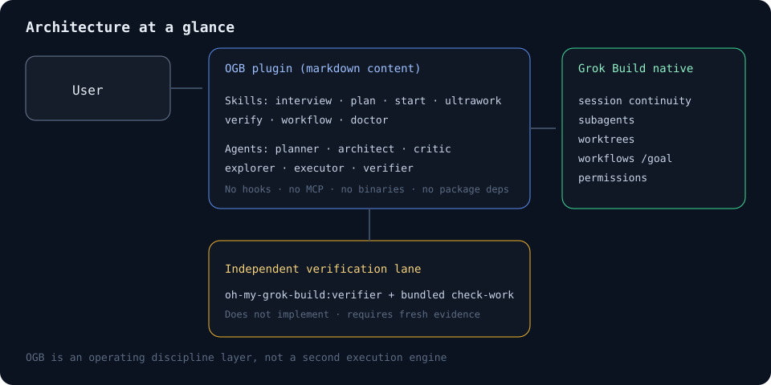

# Architecture

[한국어](architecture.ko.md)

## Goal

`oh-my-grok-build` is not an execution engine but an **operating discipline layer**. Grok Build owns the session and the tools; this plugin defines the order and evidence bar for using them.

One-line positioning: lightweight orchestration discipline for Grok Build — consensus planning, bounded parallel execution, and independent verification — without replacing native runtime features.



```text
User
  └─ OGB skills
      ├─ Clarify: one question per turn → direction brief
      ├─ Plan: planner → architect → critic
      ├─ Execute: explorer / executor + native worktree
      ├─ Parallel: native subagents or native workflow
      ├─ Graph: DAG audit → phased fan-out → layered fan-in → verify
      └─ Verify: direct checks → verifier → check-work

Grok Build native layer
  ├─ session / plan / goal
  ├─ subagents / capability modes
  ├─ git worktrees
  ├─ Rhai workflows
  ├─ skills / agents / plugins
  └─ MCP inheritance / permissions

Not present in OGB
  ├─ daemon / long-lived process
  ├─ state database
  └─ external orchestrator
```

## Division of responsibility

| Concern | Owner |
|---|---|
| Session save/resume | Grok Build |
| Autonomous goal state | Grok Build `/goal` |
| Subagent lifecycle | Grok Build |
| Worktree create/apply/clean up | Grok Build |
| Workflow execution, budget, pause | Grok Build |
| Plugin trust and MCP inheritance | Grok Build |
| Plan quality gate | oh-my-grok-build |
| Execution wave and task-ownership rules | oh-my-grok-build |
| Completion evidence and independent verification order | oh-my-grok-build |

## Lifecycle boundaries

OGB keeps four related lifecycles separate so that reusing a plan is never mistaken for resuming a session or workflow.

| Lifecycle | Owner | OGB record |
|---|---|---|
| Saved plan | Grok Build plan controls | `current-saved-plan`, `explicit-plan-path`, or `concrete-task` |
| Session continue or resume | Grok Build `grok -c` / `grok -r` | `same-session`, `grok-continue`, `grok-resume`, or `not-applicable` |
| Saved workflow definition and workflow run | Grok Build workflow runtime | Definition path, validation state, run state, and native resume path as separate facts |
| Worktree integration and cleanup | Grok Build worktrees, directed by the executing user or agent | Integrated worktrees, residual worktrees, cleanup owner, and manual next action |

Only execution from the current saved plan can carry session-continuity metadata. An explicit plan file or concrete task uses `not-applicable`; OGB never claims a native resume merely because the inputs look similar.

## State strategy

v0.1 does not create a separate database or JSON state file.

- Plans use Grok Build's current saved plan.
- Execution progress uses native todo, subagent, workflow, and goal state.
- Long-term memory is opt-in via Grok Build's `/remember` or memory feature.
- If persistent documentation is needed, the user explicitly exports the plan to a repository document.

This boundary keeps session recovery and concurrent-execution responsibility inside a single runtime.

## Parallel execution rules

- Concurrent implementation agents use a max-safe ceiling `C* = min(N_ready, iso_cap, remaining_child_calls, 8)`. `iso_cap` is 4 by default when ownership is separable, raised to 8 only when file or subsystem ownership and execution-resource isolation are both proven for every concurrent member, and lowered to 2 when tasks share a schema, configuration, generated file, dependency lock, build output, cache, container, port, database, or external environment. A task that reads a file another selected task writes is a dependency rather than a parallel peer, even when file ownership is disjoint. Prefer launching `C = C*` when isolation allows; under-launch requires an explicit reason.
- `/ogb-ultrawork` chooses mechanism before scoring: more than four repeated or schema-shaped tasks prefer native workflow even when isolation would allow high spawn concurrency. Heterogeneous five-to-eight tasks may still use `spawn_subagent` under `C*`.
- Spawn-path children receive a closed `ROLE_LENS` (`general | backend | frontend | data | sre | security | docs | test`) in the prompt. Default spawn types remain `oh-my-grok-build:executor` and `oh-my-grok-build:explorer` only.
- Lifetime child-agent residual without approval is `16 − (prior_spawn_children + prior_workflow_logical_agents)`. Workflow `agent_budget` (default 8) is a per-workflow cap, not a second unlimited pool.
- Repeated fan-out uses native workflow, with a default `agent_budget` of 8.
- Writes default to worktree isolation.
- No two agents own the same file at the same time.
- Default (baseline / `/ogb-start` style): between waves, run diff review and narrow verification. `/ogb-start` keeps its simpler bound; formal `C*` and ROLE_LENS are ultrawork protocol.
- `/ogb-ultrawork` is progressive within a wave: review each child's diff as soon as that child finishes (read-only; do not wait for a wave-wide comparison before reviewing a finished child); backfill freed slots when an unstarted task's ownership is already proven disjoint (recompute `C*` first); integrate worktree results one at a time and rerun narrow checks after each apply.
- `/ogb-graph` is a third execution mode for mixed-dependency work. It prints a short phase plan and starts Phase 1 in the same invocation. Ready nodes fan out in batches of 10–25 with a concurrent cap of 8 and a lifetime cap of 16 child calls; fan-in layers of 20–30 must name missing IDs. It does not nest `/ogb-ultrawork`, `/ogb-start`, or `/ogb-workflow`, and it does not use ultrawork `C*` or `ROLE_LENS`. Write nodes still use worktree isolation. Irreversible actions stay inline behind a human gate.

## Verification rules

```text
Define acceptance criteria
  → direct test/typecheck/build
  → independent verifier reproduction
  → bundled check-work final check
  → PASS / FAIL / INCONCLUSIVE
```

`check-work` does not replace tests, and it does not take the implementer's reported results at face value.

## Security boundary

The v0.1 plugin includes no hooks, MCP, LSP, executable binaries, or network installers. However, skills and agents can request commands and file changes under the user's Grok permissions, so reviewing the install source and using a proper permission mode are still required.
